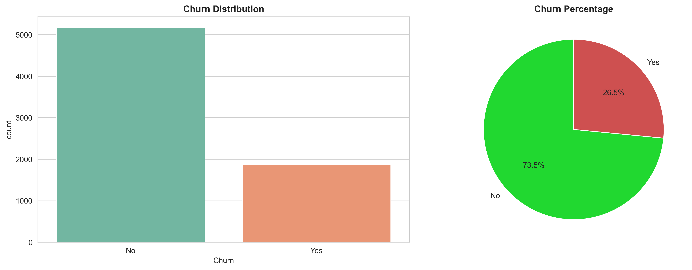
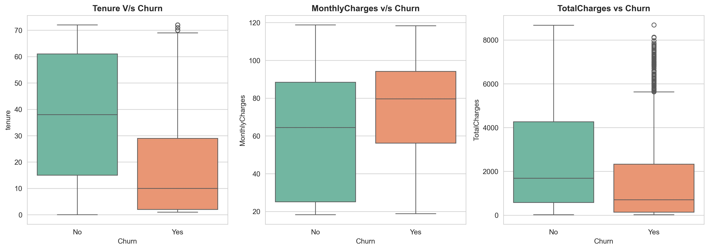
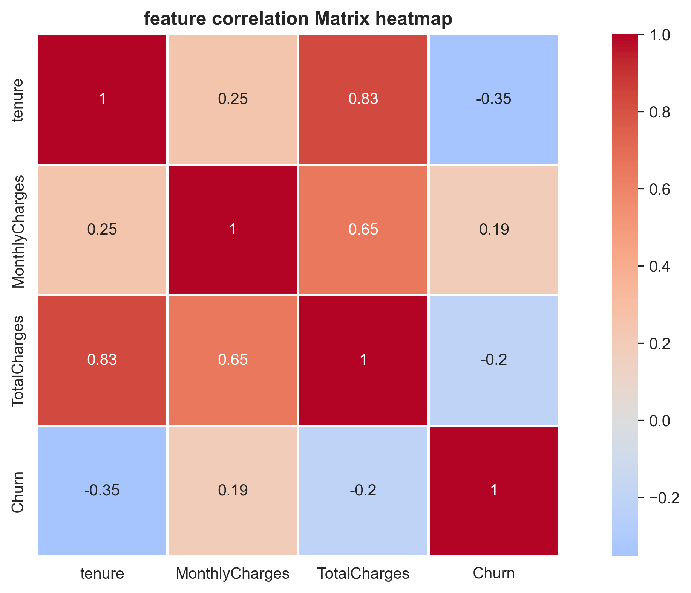
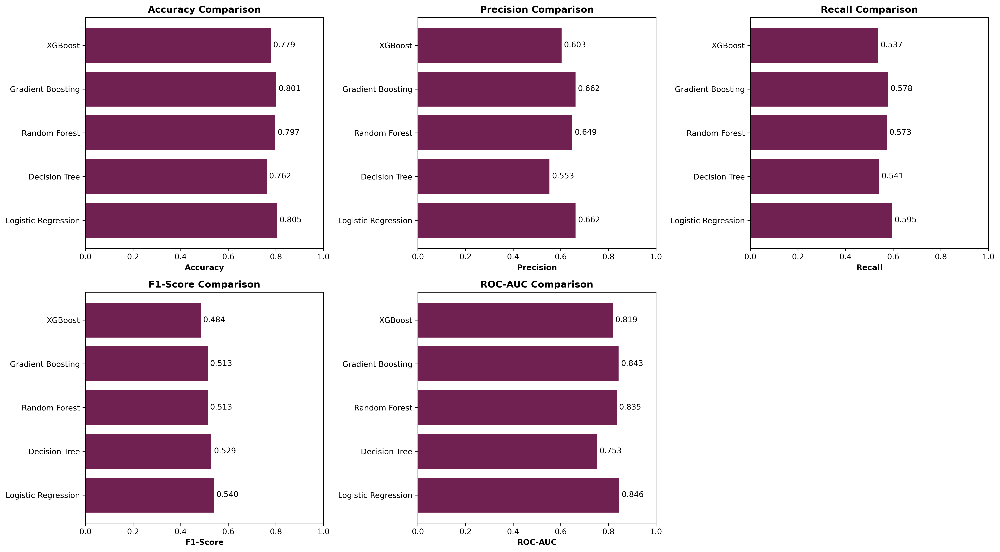
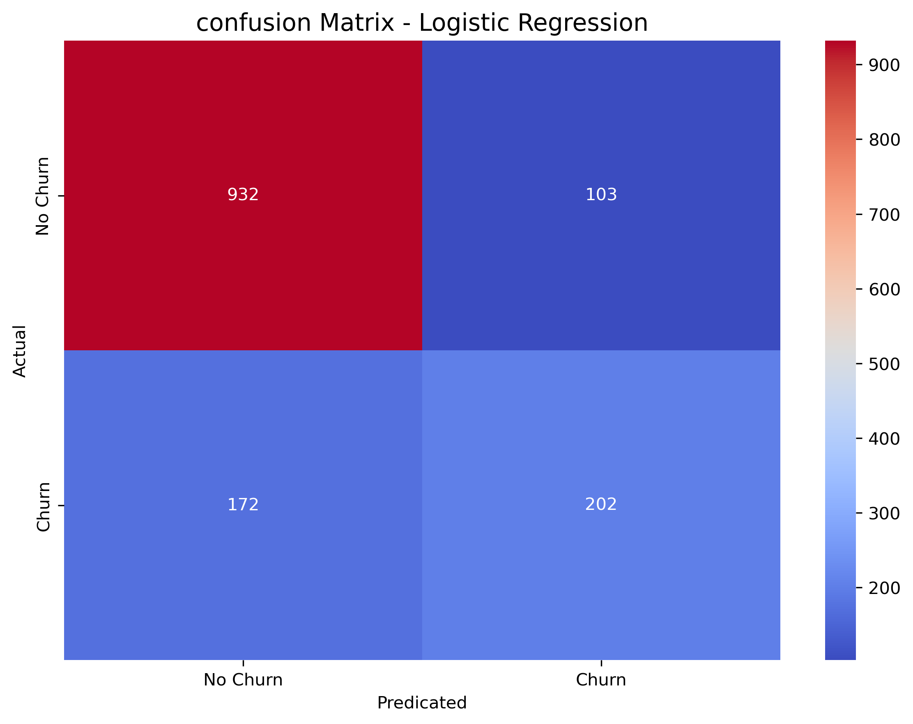
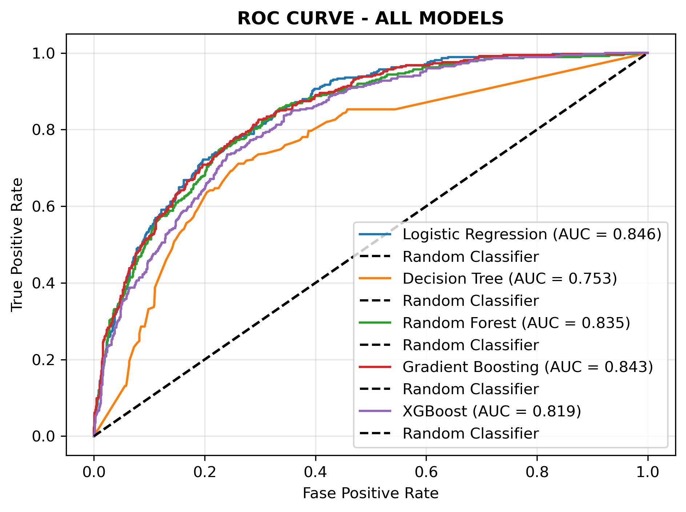

# Customer Churn Prediction System

[](https://www.python.org/)
[](https://streamlit.io/)
[](https://scikit-learn.org/)
[](https://render.com/)

A machine learning web application that predicts whether a telecom customer is likely to churn based on demographic, account, billing, contract, and service usage information.

## Live Demo

Try the deployed Streamlit app here:

**[Customer Churn Prediction System - Render Live App](https://churn-prediction-3ro1.onrender.com/)**

## Repository

GitHub repository:

**[https://github.com/RIT8603/churn_prediction.git](https://github.com/RIT8603/churn_prediction.git)**

## Project Overview

Customer churn is a major business problem for subscription-based companies. This project uses historical telecom customer data to train and compare multiple machine learning models, then serves the best model through an interactive Streamlit web app.

The app allows users to enter customer details and receive:

- A churn or retention prediction
- Churn and retention probability scores
- A confidence breakdown chart
- Key risk factors based on the entered customer profile
- Suggested retention actions for high-risk customers

## Problem Statement

Telecom companies often lose customers because of pricing issues, short contracts, poor service experience, or lack of customer support. The goal of this project is to build a machine learning system that can identify customers who are likely to churn before they actually leave.

By predicting churn early, a business can take targeted actions such as offering discounts, improving support, recommending better plans, or engaging customers through loyalty programs.

## Business Use Case

This project can help customer success, marketing, and retention teams:

- Identify high-risk customers before churn happens
- Prioritize retention campaigns
- Understand customer risk factors
- Reduce customer acquisition replacement costs
- Improve long-term customer lifetime value
- Support data-driven decision-making for telecom customer retention

## Key Features

- End-to-end machine learning workflow for churn prediction
- Exploratory data analysis notebooks
- Data preprocessing and feature engineering pipeline
- Multiple model comparison
- Best trained model saved as a Pickle file
- Reusable preprocessing object saved with Joblib
- Interactive Streamlit prediction interface
- High-risk and low-risk quick test profiles
- Probability-based prediction output
- Risk factor explanation inside the web app
- Visual report outputs stored in the `Report/` folder

## Tech Stack

| Category | Tools / Libraries |
|---|---|
| Programming Language | Python |
| Data Processing | pandas, NumPy |
| Machine Learning | scikit-learn, XGBoost |
| Model Persistence | Joblib |
| Visualization | Matplotlib, Seaborn, Plotly |
| Web App | Streamlit |
| Deployment | Render |
| Development | Jupyter Notebook |

## Dataset Information

The project uses the dataset file:

```text
Dataset/WA_Fn-UseC_-Telco-Customer-Churn.csv
```

Dataset summary found in the repository:

| Detail | Value |
|---|---:|
| Rows | 7,043 |
| Columns | 21 |
| Target column | `Churn` |
| Non-churn customers | 5,174 |
| Churn customers | 1,869 |

Dataset columns:

```text
customerID, gender, SeniorCitizen, Partner, Dependents, tenure,
PhoneService, MultipleLines, InternetService, OnlineSecurity,
OnlineBackup, DeviceProtection, TechSupport, StreamingTV,
StreamingMovies, Contract, PaperlessBilling, PaymentMethod,
MonthlyCharges, TotalCharges, Churn
```

Dataset source:

```text
[Add dataset source here]
```

## Data Preprocessing Steps

The preprocessing logic is implemented in:

```text
src/data_preprocessing.py
```

Main preprocessing steps:

1. Load the Telco customer churn CSV file.
2. Convert `TotalCharges` to numeric values.
3. Fill missing `TotalCharges` values with the median.
4. Create additional engineered features.
5. Drop `customerID` before training.
6. Encode binary categorical columns such as `Partner`, `Dependents`, `PhoneService`, and `PaperlessBilling`.
7. Encode `gender`.
8. Encode remaining categorical features with `LabelEncoder`.
9. Split data into training and testing sets using stratified sampling.
10. Scale numerical columns with `StandardScaler`.

The train-test split uses:

```text
test_size = 0.2
random_state = 42
stratify = y
```

## Feature Engineering

The project creates three additional features:

| Feature | Description |
|---|---|
| `tenure_group` | Groups customer tenure into bins: 0-12, 13-24, 25-48, and 49-72 months |
| `avg_monthly_per_tenure` | Calculates average total charge per tenure period using `TotalCharges / (tenure + 1)` |
| `num_services` | Counts selected services marked as `Yes` |

These features are also recreated in `app.py` before making predictions so that web app input follows the same general structure as the training pipeline.

## Machine Learning Models Used

The model training notebook compares the following classifiers:

- Logistic Regression
- Decision Tree
- Random Forest
- Gradient Boosting
- XGBoost

Training and comparison work is available in:

```text
Notebook/03_model_training.ipynb
```

## Best Model and Performance Metrics

The best model saved in the repository is:

```text
models/best_model_logistic_regression.pkl
```

The saved preprocessing object is:

```text
models/preprocessor.pkl
```

Model comparison results from `Report/model_comparision.csv`:

| Model | Accuracy | Precision | F1-Score | ROC-AUC | Recall |
|---|---:|---:|---:|---:|---:|
| Logistic Regression | 0.8048 | 0.6623 | 0.5950 | 0.8459 | 0.5401 |
| Gradient Boosting | 0.8013 | 0.6621 | 0.5783 | 0.8431 | 0.5134 |
| Random Forest | 0.7970 | 0.6486 | 0.5731 | 0.8351 | 0.5134 |
| XGBoost | 0.7786 | 0.6033 | 0.5371 | 0.8190 | 0.4840 |
| Decision Tree | 0.7615 | 0.5531 | 0.5410 | 0.7530 | 0.5294 |

Best model:

```text
Logistic Regression
```

The Streamlit sidebar displays the best model as Logistic Regression with approximately:

```text
ROC-AUC Score: 0.8458
Accuracy: 80.41%
F1-Score: 0.5929
```

## Streamlit App Features

The Streamlit application is implemented in:

```text
app.py
```

The web app includes input controls for:

- Gender
- Senior citizen status
- Partner and dependent status
- Tenure
- Contract type
- Paperless billing
- Payment method
- Monthly charges
- Total charges
- Phone service
- Multiple lines
- Internet service
- Online security
- Online backup
- Device protection
- Tech support
- Streaming TV
- Streaming movies

Additional app features:

- Loads the trained model and preprocessor from the `models/` folder
- Provides high-risk and low-risk quick test profiles
- Displays churn or retention probability
- Shows a horizontal confidence breakdown chart with Plotly
- Lists key risk factors such as:
  - Month-to-month contract
  - Short tenure
  - High monthly charges
  - No online security
  - No tech support
  - Electronic check payment
  - No partner
- Provides suggested actions for high-risk customers

## Sample Output / Prediction Explanation

After the user fills in customer details and clicks **Predict Churn**, the app:

1. Builds a single-row customer input dataframe.
2. Applies preprocessing and feature engineering.
3. Uses the trained Logistic Regression model to predict the class.
4. Uses `predict_proba()` to calculate churn and retention probabilities.
5. Displays one of two result states:

| Prediction | Meaning |
|---|---|
| `1` | Customer is likely to churn |
| `0` | Customer is likely to stay |

For a high-risk prediction, the app displays a warning-style result box and recommends immediate retention actions. For a low-risk prediction, it displays a positive retention result and suggests maintaining service quality and customer engagement.

## Project Folder Structure

Actual tracked project structure:

```text
churn_prediction/
|
+-- Dataset/
|   +-- WA_Fn-UseC_-Telco-Customer-Churn.csv
|
+-- Notebook/
|   +-- 01_eda.ipynb
|   +-- 02_data_preprocessing.ipynb
|   +-- 03_model_training.ipynb
|
+-- Report/
|   +-- Categorical_analysis.png
|   +-- churn_distribution.png
|   +-- confusion_matrix.png
|   +-- correlation_heatmap.png
|   +-- model_comparision.csv
|   +-- model_comparision_graph.png
|   +-- numerical_analysis.jpg
|   +-- roc_curve.jpg
|
+-- models/
|   +-- best_model_logistic_regression.pkl
|   +-- preprocessor.pkl
|
+-- others/
|   +-- note.txt
|
+-- src/
|   +-- data_preprocessing.py
|
+-- .gitignore
+-- app.py
+-- README.md
+-- requirements.txt
```

## Installation

Clone the repository:

```bash
git clone https://github.com/RIT8603/churn_prediction.git
cd churn_prediction
```

Create and activate a virtual environment:

```bash
python -m venv venv
```

On Windows:

```bash
venv\Scripts\activate
```

On macOS/Linux:

```bash
source venv/bin/activate
```

Install dependencies:

```bash
pip install -r requirements.txt
```

## How to Run Locally

Run the Streamlit app:

```bash
streamlit run app.py
```

Then open the local URL shown in the terminal, usually:

```text
http://localhost:8501
```

## How to Use the Web App

1. Open the live demo or run the project locally.
2. Fill in the customer demographic, account, billing, and service details.
3. Optionally use the sidebar buttons to load a high-risk or low-risk test profile.
4. Click **Predict Churn**.
5. Review the prediction result, probability chart, and risk factors.
6. Use the suggested actions to guide customer retention decisions.

## Deployment on Render

The project is deployed on Render at:

```text
https://churn-prediction-3ro1.onrender.com/
```

Typical Render deployment setup for this Streamlit app:

```text
Build Command: pip install -r requirements.txt
Start Command: streamlit run app.py --server.port $PORT --server.address 0.0.0.0
```

If your Render service uses a different configuration, add it here:

```text
[Add exact Render deployment settings here]
```

## Reports and Visual Outputs

The repository includes generated analysis and model evaluation visuals in the `Report/` folder.

### Churn Distribution



### Categorical Analysis


### Numerical Analysis



### Correlation Heatmap



### Model Comparison



### Confusion Matrix



### ROC Curve



## Screenshots

Add Streamlit web app screenshots here:

```text
[Add home page screenshot here]
[Add customer input form screenshot here]
[Add prediction result screenshot here]
```

## Future Improvements

- Add more detailed model explainability with SHAP or feature importance charts.
- Add batch prediction using CSV upload.
- Improve handling of unseen categorical values in production.
- Add automated tests for preprocessing and prediction functions.
- Add app screenshots to the README.
- Add a dedicated `render.yaml` deployment configuration.
- Experiment with hyperparameter tuning for tree-based models.
- Add model versioning and experiment tracking.
- Add dataset source and data dictionary documentation.

## Author

**Ritesh**

GitHub: [RIT8603](https://github.com/RIT8603)

Project repository: [churn_prediction](https://github.com/RIT8603/churn_prediction.git)
